# Bayesian Optimization — Concept Map & Index

The single entry point to this wiki. The **registry** lists every concept with its one-line
summary, prerequisites, sources, coverage grade, and review status; the **prerequisite graph**
draws the dependency DAG; the **learning tracks** give guided reading orders by subtopic; the
**cross-cutting connections** name the structural threads that tie concepts together.

## How to use this index

- **Humans:** start from a [learning track](#learning-tracks) for your subtopic, or scan the
  [registry](#concept-registry) for a one-line map of everything. The
  [prerequisite graph](#prerequisite-graph) shows what to read first.
- **Agents:** read this index *before* opening notes or `raw/` sources. It tells you which
  concepts already exist, what each covers, which sources back it, and how concepts depend on one
  another — so you can pull only the relevant notes/sources into context instead of scanning the
  whole corpus. When adding a source or concept, check the registry to decide what to **extend**
  vs. what to **add**.

**Coverage grade.** `derivation` = full derivation-grade treatment · `concept` = concept-grade
overview (definition, key formula, pointers) · `reference` = reference material (e.g. notation) ·
`stub` = placeholder, minimal coverage.

**Reviewed.** A date marks the last time the note passed a critical-review / judge pass
(accuracy, math, pedagogy, connections); `—` means not yet reviewed under that bar.

**Sources.** The first source key (marked `&#9656;`) is the note's *derivation-primary*; the rest
are secondary (attribution, crosswalk, gap-fill). Full bibliography in
[`references.md`](../references.md).

> The registry and graph below are **autogenerated** from note frontmatter by
> `scripts/build_index.py` (run on every commit via the pre-commit hook). Do not hand-edit between
> the `autogen` markers. Everything outside the markers is curated.

## Concept registry

<!-- autogen:registry:start -->
| Concept | Summary | Tags | Requires | Sources (&#9656;=derivation-primary) | Grade | Reviewed |
|---------|---------|------|----------|--------------------------------|-------|----------|
| [[acquisition-functions\|Acquisition Functions]] | The decision rule of the BO loop; taxonomy of acquisition strategies. | acquisition · taxonomy · decision-theoretic · hub | [[problem-setup]] · [[gaussian-process-regression]] | frazier2018&#9656; · shahriari2016 | concept | — |
| [[bo-as-dynamic-program\|Bayesian Optimization as a Dynamic Program]] | BO as a finite-horizon sequential decision process; parent frame of myopic rules. | decision-theoretic · lookahead · non-myopic · theory | [[problem-setup]] · [[gaussian-process-regression]] · [[acquisition-functions]] · [[value-of-information]] · [[expected-improvement]] | lam2016&#9656; · frazier2018 · frazier2009kg · astudillo2021 | derivation | — |
| [[budget-constrained-dp\|Budget-Constrained BO as a Dynamic Program]] | Cost-aware BO under a total-budget cap as a random-horizon dynamic program. | cost-aware · non-myopic · lookahead · decision-theoretic · theory | [[bo-as-dynamic-program]] · [[cost-aware-bo]] · [[ei-per-unit-cost]] | astudillo2021&#9656; · lam2016 · lee2021 | derivation | — |
| [[multistep-budgeted-bo\|Budgeted Multi-Step Expected Improvement]] | Budgeted multi-step EI (B-MS-EI): non-myopic cost-aware lookahead via the budget DP. | cost-aware · non-myopic · lookahead · acquisition | [[budget-constrained-dp]] · [[expected-improvement]] · [[cost-models]] | astudillo2021&#9656; · lam2016 · lee2021 · wilson2018 | derivation | — |
| [[cost-cooling-carbo\|Cost Cooling and CArBO]] | Annealing the cost penalty over the budget (cost-cooling) and CArBO initialization. | cost-aware · acquisition · myopic | [[ei-per-unit-cost]] · [[expected-improvement]] · [[cost-aware-bo]] | lee2020&#9656; | derivation | — |
| [[cost-models\|Cost Models]] | Modeling unknown evaluation cost c(x), typically a log-GP, as a second surrogate. | cost-aware · surrogate | [[gaussian-process-regression]] · [[cost-aware-bo]] | lee2020&#9656; · lee2021 · snoek2012 | concept | — |
| [[cost-aware-bo\|Cost-Aware Bayesian Optimization]] | Budgeting real evaluation cost, not iteration count; the cost-aware formulations and family map. | cost-aware · acquisition · taxonomy | [[acquisition-functions]] · [[expected-improvement]] | lee2020&#9656; · shahriari2016 · snoek2012 · xie2025 · xie2024 | concept | — |
| [[cost-aware-stopping\|Cost-Aware Stopping (PBGI / LogEIPC)]] | When to stop under cost-per-sample: the PBGI/LogEIPC rule plus cost-adjusted-regret theory. | cost-aware · acquisition · stopping · decision-theoretic | [[cost-aware-bo]] · [[pandoras-box-gittins-index]] · [[ei-per-unit-cost]] · [[expected-improvement]] | xie2025&#9656; · xie2024 · astudillo2021 | derivation | — |
| [[ei-per-unit-cost\|EI Per Unit Cost]] | The simplest cost-aware acquisition: expected improvement divided by cost. | cost-aware · acquisition · myopic | [[expected-improvement]] · [[cost-aware-bo]] | snoek2012&#9656; · lee2020 · xie2024 | derivation | — |
| [[entropy-search\|Entropy Search]] | Information-theoretic acquisition: sample to reduce entropy of the optimizer location. | acquisition · information-theoretic · lookahead | [[problem-setup]] · [[gaussian-process-regression]] · [[acquisition-functions]] · [[value-of-information]] · [[thompson-sampling-bo]] | hennig2012&#9656; · frazier2018 | derivation | — |
| [[expected-improvement\|Expected Improvement]] | The default acquisition: expected gain over the incumbent, closed-form under a GP. | acquisition · myopic · decision-theoretic | [[gaussian-process-regression]] · [[problem-setup]] | frazier2018&#9656; · jones98 · mockus1978 · snoek2012 | derivation | — |
| [[gaussian-process-regression\|Gaussian Process Regression]] | The Bayesian surrogate underneath BO: GP prior to posterior over the objective. | surrogate · bayesian-model · foundation | [[problem-setup]] | frazier2018&#9656; · jones98 · srinivas2010 | derivation | — |
| [[gp-hyperparameters\|GP Hyperparameters]] | Fitting GP kernel/mean hyperparameters: MLE, MAP, fully-Bayesian marginalization. | surrogate · bayesian-model · inference | [[gaussian-process-regression]] · [[problem-setup]] | snoek2012&#9656; · frazier2018 | derivation | — |
| [[gp-ucb\|GP-UCB and the Optimism Principle]] | Optimism-in-the-face-of-uncertainty: the regret-bearing upper-confidence-bound rule. | acquisition · optimistic · bandit · theory-adjacent | [[problem-setup]] · [[gaussian-process-regression]] | srinivas2010&#9656; · frazier2018 | derivation | — |
| [[knowledge-gradient\|Knowledge Gradient]] | One-step value-of-information on the global max; EI's lookahead cousin. | acquisition · lookahead · decision-theoretic · value-of-information | [[problem-setup]] · [[gaussian-process-regression]] · [[expected-improvement]] · [[value-of-information]] | frazier2009kg&#9656; · frazier2018 | derivation | — |
| [[max-value-entropy-search\|Max-Value Entropy Search]] | Information-theoretic acquisition targeting the max-value, not its location. | acquisition · information-theoretic · lookahead | [[problem-setup]] · [[gaussian-process-regression]] · [[acquisition-functions]] · [[entropy-search]] | wang2017mes&#9656; | derivation | — |
| [[nonmyopic-cost-constrained-bo\|Nonmyopic Cost-Constrained BO (CMDP Rollout)]] | Cost-constrained BO as a fixed-horizon CMDP solved by rollout. | cost-aware · non-myopic · lookahead · decision-theoretic | [[bo-as-dynamic-program]] · [[cost-aware-bo]] · [[ei-per-unit-cost]] · [[budget-constrained-dp]] | lee2021&#9656; · lam2016 · astudillo2021 | derivation | — |
| [[notation\|Notation]] | Canonical symbol table for the whole wiki. | reference | — | frazier2018&#9656; · snoek2012 | reference | — |
| [[pandoras-box-gittins-index\|Pandora's Box Gittins Index (PBGI)]] | Pandora's-box Gittins fair-value acquisition (PBGI); optimal index, small-lambda to UCB limit. | cost-aware · acquisition · decision-theoretic | [[cost-aware-bo]] · [[ei-per-unit-cost]] · [[expected-improvement]] · [[budget-constrained-dp]] | xie2024&#9656; · astudillo2021 | derivation | — |
| [[predictive-entropy-search\|Predictive Entropy Search]] | A cheaper reformulation of entropy search via predictive-distribution symmetry. | acquisition · information-theoretic · lookahead | [[problem-setup]] · [[gaussian-process-regression]] · [[acquisition-functions]] · [[entropy-search]] | hernandez2014&#9656; · hennig2012 | derivation | — |
| [[probability-of-improvement\|Probability of Improvement]] | The oldest improvement acquisition: probability of beating the incumbent. | acquisition · myopic · decision-theoretic | [[problem-setup]] · [[gaussian-process-regression]] · [[expected-improvement]] | shahriari2016&#9656; · frazier2018 · jones98 | derivation | — |
| [[problem-setup\|Problem Setup]] | Black-box derivative-free global optimization: the problem BO solves. | foundations · problem-formulation | — | frazier2018&#9656; · jones98 | concept | — |
| [[thompson-sampling-bo\|Thompson Sampling (Bayesian Optimization)]] | Randomized acquisition: act greedily on a posterior sample of the objective. | acquisition · randomized · information-theoretic | [[problem-setup]] · [[gaussian-process-regression]] | shahriari2016&#9656; | derivation | — |
| [[value-of-information\|Value of Information]] | The decision-theoretic quantity underneath every acquisition; the VoI frame. | acquisition · decision-theoretic · myopic · lookahead | [[problem-setup]] · [[gaussian-process-regression]] · [[expected-improvement]] · [[acquisition-functions]] | frazier2018&#9656; · frazier2009kg | derivation | — |
<!-- autogen:registry:end -->

## Prerequisite graph

Edges point from prerequisite to dependent concept (read the source of an arrow before its target).

```mermaid
graph TD
    problem-setup --> acquisition-functions
    gaussian-process-regression --> acquisition-functions
    problem-setup --> bo-as-dynamic-program
    gaussian-process-regression --> bo-as-dynamic-program
    acquisition-functions --> bo-as-dynamic-program
    value-of-information --> bo-as-dynamic-program
    expected-improvement --> bo-as-dynamic-program
    bo-as-dynamic-program --> budget-constrained-dp
    cost-aware-bo --> budget-constrained-dp
    ei-per-unit-cost --> budget-constrained-dp
    acquisition-functions --> cost-aware-bo
    expected-improvement --> cost-aware-bo
    cost-aware-bo --> cost-aware-stopping
    pandoras-box-gittins-index --> cost-aware-stopping
    ei-per-unit-cost --> cost-aware-stopping
    expected-improvement --> cost-aware-stopping
    ei-per-unit-cost --> cost-cooling-carbo
    expected-improvement --> cost-cooling-carbo
    cost-aware-bo --> cost-cooling-carbo
    gaussian-process-regression --> cost-models
    cost-aware-bo --> cost-models
    expected-improvement --> ei-per-unit-cost
    cost-aware-bo --> ei-per-unit-cost
    problem-setup --> entropy-search
    gaussian-process-regression --> entropy-search
    acquisition-functions --> entropy-search
    value-of-information --> entropy-search
    thompson-sampling-bo --> entropy-search
    gaussian-process-regression --> expected-improvement
    problem-setup --> expected-improvement
    problem-setup --> gaussian-process-regression
    gaussian-process-regression --> gp-hyperparameters
    problem-setup --> gp-hyperparameters
    problem-setup --> gp-ucb
    gaussian-process-regression --> gp-ucb
    problem-setup --> knowledge-gradient
    gaussian-process-regression --> knowledge-gradient
    expected-improvement --> knowledge-gradient
    value-of-information --> knowledge-gradient
    problem-setup --> max-value-entropy-search
    gaussian-process-regression --> max-value-entropy-search
    acquisition-functions --> max-value-entropy-search
    entropy-search --> max-value-entropy-search
    budget-constrained-dp --> multistep-budgeted-bo
    expected-improvement --> multistep-budgeted-bo
    cost-models --> multistep-budgeted-bo
    bo-as-dynamic-program --> nonmyopic-cost-constrained-bo
    cost-aware-bo --> nonmyopic-cost-constrained-bo
    ei-per-unit-cost --> nonmyopic-cost-constrained-bo
    budget-constrained-dp --> nonmyopic-cost-constrained-bo
    cost-aware-bo --> pandoras-box-gittins-index
    ei-per-unit-cost --> pandoras-box-gittins-index
    expected-improvement --> pandoras-box-gittins-index
    budget-constrained-dp --> pandoras-box-gittins-index
    problem-setup --> predictive-entropy-search
    gaussian-process-regression --> predictive-entropy-search
    acquisition-functions --> predictive-entropy-search
    entropy-search --> predictive-entropy-search
    problem-setup --> probability-of-improvement
    gaussian-process-regression --> probability-of-improvement
    expected-improvement --> probability-of-improvement
    problem-setup --> thompson-sampling-bo
    gaussian-process-regression --> thompson-sampling-bo
    problem-setup --> value-of-information
    gaussian-process-regression --> value-of-information
    expected-improvement --> value-of-information
    acquisition-functions --> value-of-information
    notation
```

<!-- autogen:graph:start -->

<!-- autogen:graph:end -->

## Learning tracks

Curated reading orders. Each assumes the [foundations](#track-foundations) track first.

### Track: foundations
[[problem-setup]] → [[gaussian-process-regression]] → [[gp-hyperparameters]] →
[[acquisition-functions]] → [[expected-improvement]]

### Track: myopic & improvement-based acquisitions
[[expected-improvement]] → [[probability-of-improvement]] → [[gp-ucb]] → [[thompson-sampling-bo]]

### Track: decision-theoretic & lookahead
[[value-of-information]] → [[knowledge-gradient]] → [[bo-as-dynamic-program]]

### Track: information-theoretic acquisitions
[[entropy-search]] → [[predictive-entropy-search]] → [[max-value-entropy-search]]

### Track: cost-aware BO
[[cost-aware-bo]] → [[cost-models]] → [[ei-per-unit-cost]] → [[cost-cooling-carbo]] →
*(non-myopic budgeted)* [[budget-constrained-dp]] → [[multistep-budgeted-bo]] →
[[nonmyopic-cost-constrained-bo]] → *(cost-per-sample)* [[pandoras-box-gittins-index]] →
[[cost-aware-stopping]]

<!-- Track: regret & convergence theory — add when those notes land
[[gp-ucb]] → regret-gp-bandits → gp-bandit-lower-bounds → ego-convergence-rates -->

## Planned concepts

Concepts scoped but not yet written. Forward-links to these from existing notes are expected (the
linter treats them as known, not broken). Remove an entry once its note lands; add one when a new
source or gap motivates it.

- `regret-gp-bandits` — GP-UCB regret upper bounds; sublinear cumulative regret under a GP prior (srinivas2010).
- `ego-convergence-rates` — convergence rates of EGO/EI-style methods under smoothness assumptions (bull2011).
- `gp-bandit-lower-bounds` — information-theoretic regret lower bounds; near-optimality of UCB-type methods (scarlett2017).
- `parallel-batch-bo` — batch/parallel point selection; q-EI and parallel knowledge gradient (wang2016qei, wu2019takg).
- `multi-fidelity-bo` — optimization across continuous fidelity/approximation levels (kandasamy2017).
- `noisy-evaluations` — acquisition and inference under observation noise (snoek2012, frazier2018).
- `constraints` — constrained Bayesian optimization (frazier2018, shahriari2016).
- `derivative-observations` — incorporating gradient/derivative observations (shahriari2016, frazier2018).
- `initial-design` — initialization and space-filling designs (shahriari2016, frazier2018).
- `environmental-multitask-bo` — multi-task and environmental-variable BO (shahriari2016).

## Cross-cutting connections

The structural threads that the per-note "relation" sections develop in detail:

- **Myopic ↔ non-myopic.** Every one-step acquisition is a horizon-1 truncation of the
  [[bo-as-dynamic-program|sequential decision process]]; [[knowledge-gradient]] is one-step
  [[value-of-information]], [[expected-improvement]] is its incumbent-referenced special case.
- **Value-of-information spine.** [[value-of-information]] is the decision-theoretic quantity
  underneath [[expected-improvement]], [[knowledge-gradient]], and the entropy family.
- **Optimism axis.** [[gp-ucb]] (deterministic optimism) ↔ [[thompson-sampling-bo]] (randomized
  optimism) ↔ [[pandoras-box-gittins-index]] (small-λ limit recovers UCB-type behavior).
- **Information axis.** [[thompson-sampling-bo]] → [[entropy-search]] → {[[predictive-entropy-search]],
  [[max-value-entropy-search]]} trade different information targets (optimizer location vs. max-value).
- **Cost-aware split.** budget-constrained ([[ei-per-unit-cost]], [[cost-cooling-carbo]]) and
  DP-budgeted ([[budget-constrained-dp]], [[multistep-budgeted-bo]], [[nonmyopic-cost-constrained-bo]])
  vs. cost-per-sample ([[pandoras-box-gittins-index]], [[cost-aware-stopping]]).
